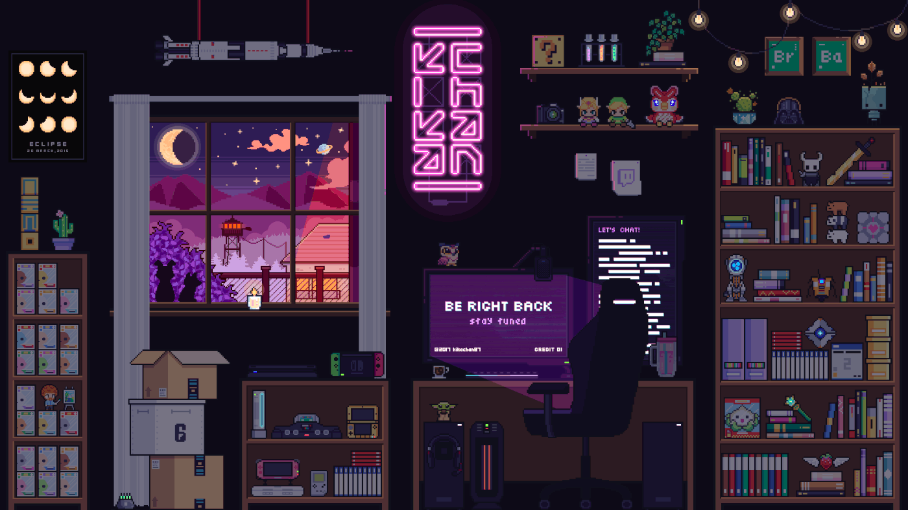

# 𐌍Ꝋ𐌉𐌃𐌋𐌄 — Tech Community Landing Page

> A pixel art · neon arcade themed Discord server website built with pure HTML, CSS & JavaScript.

[](https://discord.gg/s2fnGZxgNV)
[](https://developer.mozilla.org/en-US/docs/Web/HTML)
[](https://developer.mozilla.org/en-US/docs/Web/CSS)
[](https://developer.mozilla.org/en-US/docs/Web/JavaScript)

---

## 📸 Preview



---

## 🗂️ Project Structure

```
noidle-site/
├── index.html      # Main HTML structure & page layout
├── style.css       # All styling — pixel art / neon arcade aesthetic
├── script.js       # All interactivity & animations
├── pfp.gif         # Server profile picture (pixel room GIF)
└── README.md       # You're reading it
```

---

## ✨ Features

- **Pixel art aesthetic** — Press Start 2P font, scanline overlay, pixel-border buttons
- **Glitch animation** on the server name title
- **Typewriter effect** cycling through server highlights
- **Animated monitor card** with a live rotating fake chat feed
- **Floating pixel dust** canvas particle system
- **Neon cursor trail** following mouse movement
- **Count-up stats** — member and online counts animate on scroll
- **Scroll reveal** — sections animate in as you scroll down
- **Copy invite button** — one-click copy of the Discord invite link
- **Mobile responsive** with hamburger menu
- **Scanline CRT overlay** for the retro feel

---

## 🚀 Getting Started

No build tools. No dependencies. Just open and go.

```bash
# 1. Clone or download the repo
git clone https://github.com/your-username/noidle-site.git

# 2. Open in your browser
open index.html
```

Or drag `index.html` into any browser window.

---

## 🌐 Deployment

Since this is a static site, you can host it anywhere for free:

### Vercel
```bash
npm i -g vercel
vercel
```

### Netlify
Drag and drop the project folder at [app.netlify.com/drop](https://app.netlify.com/drop)

### GitHub Pages
1. Push the repo to GitHub
2. Go to **Settings → Pages**
3. Set source to `main` branch → `/ (root)`
4. Your site goes live at `https://your-username.github.io/noidle-site`

---

---

## 🎨 Tech Stack

| Tech | Usage |
|---|---|
| HTML5 | Page structure & semantic markup |
| CSS3 | Styling, animations, CSS variables, grid & flexbox |
| Vanilla JS | Canvas particles, typewriter, chat feed, scroll reveal, cursor trail |
| Google Fonts | Press Start 2P · Share Tech Mono · VT323 |

Zero frameworks. Zero npm. Zero build step.

---

## 📁 Key Files Explained

### `index.html`
Full page layout split into 6 sections: `nav → hero → about → features → channels → join CTA → footer`. The Discord invite link (`https://discord.gg/s2fnGZxgNV`) is wired into every CTA button.

### `style.css`
Organized top-to-bottom matching the HTML structure. All theme colors live in the `:root` block at the very top — that's your single source of truth for the entire visual design.

### `script.js`
11 self-contained IIFE modules — each does one thing. If you want to remove a feature, just delete that block. Nothing is tightly coupled.

---

## 🤝 Community

**𐌍Ꝋ𐌉𐌃𐌋𐌄** is a Discord community for tech people focused on learning, building, and growing together.

- 💻 DSA / Problem Solving sessions
- 🌐 Web Dev, AI/ML, Cybersecurity discussions
- 📅 Weekly LeetCode challenge every Sunday
- 📚 Resource sharing and progress tracking

👉 **[Join the server → discord.gg/s2fnGZxgNV](https://discord.gg/s2fnGZxgNV)**

---

## 👩‍💻 Author

Built by **SATYAM** — Front End Developer

---

